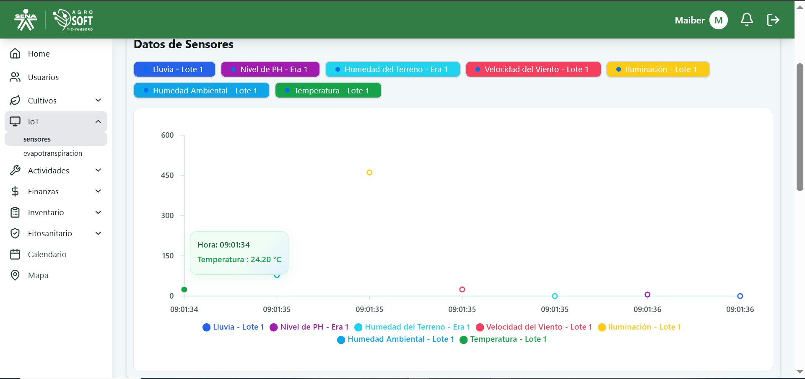

## Requerimientos Funcionales

### RF01 - EL SISTEMA DEBE PERMITIR AL USUARIO INICIAR SESIÓN
El sistema ofrecerá a los usuarios un formulario interactivo que contará con los campos Correo y Contraseña...

### RF02 - EL SISTEMA DEBE PERMITIR EL REGISTRO DE USUARIOS
Formulario interactivo con campos como Tipo de Documento, Nombre, Correo, Rol, etc.

### RF03 - EL SISTEMA DEBE PERMITIR LISTAR A LOS USUARIOS AGREGADOS POR EL ADMINISTRADOR
Muestra una lista con usuarios registrados y opción de editar o eliminar.

### RF04 - EL SISTEMA DEBE PERMITIR EDITAR LOS USUARIOS
Solo el administrador podrá editar y eliminar usuarios registrados.

### RF05 - EL SISTEMA DEBE PERMITIR REGISTRAR LOS INSUMOS AGRÍCOLAS
Incluye lista interactiva para ver, editar o eliminar insumos.

### RF06 - EL SISTEMA DEBE PERMITIR LISTAR INSUMOS REGISTRADOS PREVIAMENTE
Listado de insumos con detalles para su gestión.

### RF07 - EL SISTEMA DEBE PERMITIR MOSTRAR Y ACTUALIZAR INFORMACIÓN DE INSUMOS
Actualizar información asociada a cada insumo.

### RF08 - EL SISTEMA DEBE PERMITIR REGISTRAR HERRAMIENTAS AGRÍCOLAS
Registrar, editar o eliminar herramientas.

### RF09 - EL SISTEMA DEBE PERMITIR LISTAR HERRAMIENTAS
Listado con detalles de cada herramienta.

### RF10 - EL SISTEMA DEBE PERMITIR MOSTRAR Y ACTUALIZAR INFORMACIÓN DE HERRAMIENTAS
Actualizar información de herramientas ya registradas.

### RF11 - EL SISTEMA MOSTRARÁ INFORMACIÓN DE TODOS LOS SENSORES EN TIEMPO REAL
Velocidad del viento, temperatura, luz solar, humedad de eras, etc.

### RF12 - INFORMACIÓN SOBRE LA HUMEDAD DE LAS ERAS
Mostrar en tiempo real los datos recopilados mediante IoT.

### RF13 - INFORMACIÓN SOBRE LA HUMEDAD AMBIENTE
Mostrar datos en tiempo real sobre la humedad ambiental.

### RF14 - INFORMACIÓN SOBRE LA LUMINOSIDAD
Datos de luminosidad recolectados con sensores.

### RF16 - INFORMACIÓN SOBRE LA TEMPERATURA
Temperatura medida en tiempo real mediante sensores.

### RF19 - MONITOREO DE EVAPOTRANSPIRACIÓN
Estimar la evapotranspiración para mejorar gestión del riego.

### RF20 - ALMACENAMIENTO Y GESTIÓN HISTÓRICA DE DATOS
Guardar todos los datos recogidos para análisis histórico.

### RF21 - REGISTRAR, LISTAR Y EDITAR CULTIVOS
Formulario para registrar nombre y tipo de cultivo.

### RF22 - REGISTRO DE SEMILLEROS
Registrar unidades, fecha de siembra y salida.

### RF23 - REGISTRO Y EDICIÓN DE LOTES
Registro y edición de lotes activos.

### RF24 - IMPLEMENTACIÓN DE ERAS EN UN LOTE
Registrar, listar y editar eras de cultivo.

### RF25 - REGISTRAR NUEVOS CULTIVOS
Formulario interactivo para registrar nuevos cultivos.

### RF26 - REGISTRAR ACTIVIDADES EN LOS CULTIVOS
Formulario con nombre, descripción y fecha.

### RF27 - ASIGNACIÓN Y EDICIÓN DE ACTIVIDADES EN CULTIVOS
Asignar insumos, herramientas, personal y fechas.

### RF28 - FINALIZACIÓN DE ACTIVIDAD REALIZADA
Cambiar estado e ingresar tiempo, insumos y observaciones.

### RF29 - REGISTRO DE PRODUCCIÓN DE UN CULTIVO
Incluye cantidad, unidad, fecha y foto.

### RF30 - REGISTRO DE PLAGAS, ENFERMEDADES Y ARVENSES
Datos como nombre, nivel de daño, acciones de control.

### RF31 - CONTROL FITOSANITARIO POR CULTIVO
Registro de acciones tomadas para erradicar plagas.

### RF34 - RECORDATORIOS Y EVENTOS EN CALENDARIO
Registrar fertilizaciones, siembras y cosechas.

### RF35 - MAPA CON CULTIVO Y DESCRIPCIÓN
Visualizar en mapa los cultivos y su historial.

### RF36 - ASIGNACIÓN DE ROLES Y PERMISOS
Asignar permisos según perfil de usuario.

### RF38 - CONTROL DE ARDUINOS
Guardar y cambiar configuraciones del microcontrolador.

### RF41 - GENERAR REPORTE DE USUARIOS
Análisis de actividad, uso y problemas frecuentes.

### RF42 - REPORTE DE CONTROLES REALIZADOS
Control aplicado a plagas/enfermedades.

---

