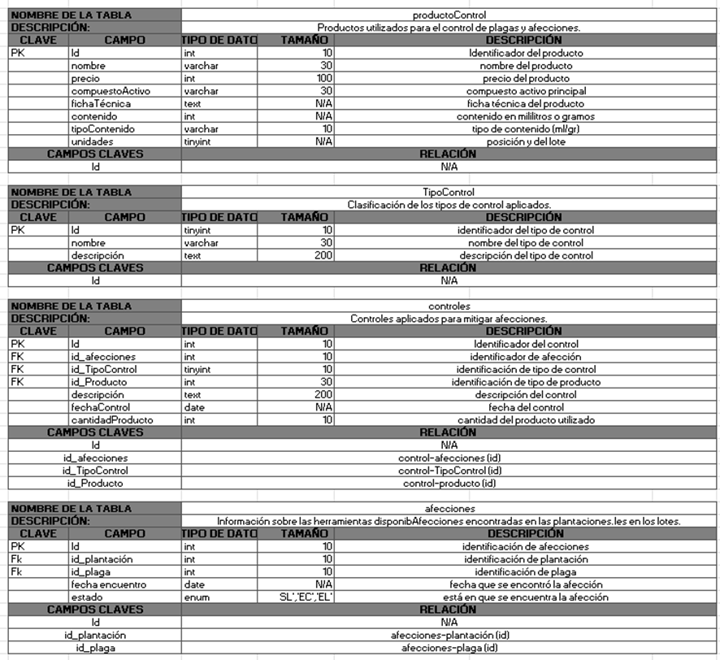
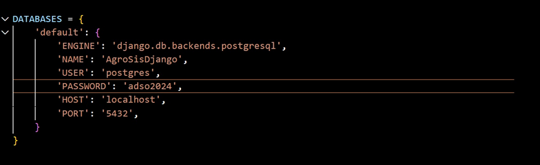

## 1. Introducción

Este documento describe el proceso de configuración e implementación de la base de datos para el proyecto **Sistema de Seguimiento y Trazabilidad de Actividades Relacionadas con el Cultivo y la Producción Agrícola**. Este sistema está diseñado para gestionar y registrar información sobre el control fitosanitario, riego, fertilización, insumos y monitoreo dentro del C.G.D.S.S.

El objetivo principal es proporcionar una herramienta eficiente que permita el seguimiento detallado de cada actividad agrícola, garantizando la trazabilidad de los procesos y optimizando la toma de decisiones. Para ello, se ha diseñado una base de datos estructurada que centraliza la información y facilita su consulta y análisis.

A lo largo de este manual, se presentarán los modelos de datos utilizados, el diccionario de datos, los scripts de creación, y los pasos necesarios para la correcta configuración y ejecución del sistema de base de datos.

## 2. Alcance

El sistema permitirá:

- Registrar y gestionar actividades agrícolas de manera estructurada.
- Llevar un seguimiento detallado de cada proceso productivo.
- Optimizar la trazabilidad de insumos y recursos utilizados en los cultivos.
- Facilitar la consulta y análisis de datos históricos para la toma de decisiones.
- Mejorar la eficiencia en la gestión de actividades agrícolas a través de una base de datos centralizada.

### Proyectos Asociados

Este sistema se implementará dentro del C.G.D.S.S, pero puede ser escalable para su uso en otros entornos agrícolas con necesidades similares de trazabilidad y control de producción.

### Áreas Afectadas

- Agricultores y técnicos encargados del monitoreo y control de cultivos.
- Gestores de producción responsables de la administración de insumos y recursos.
- Entidades reguladoras que requieran información trazable sobre las actividades agrícolas.

## 3. Responsables e involucrados

En esta sección deben indicar el o los involucrados en el desarrollo del proyecto.

| Nombre     | Tipo        | Rol          |
|------------|-------------|--------------|
| `Maiber Jhadir Cordoba` | `Responsable`    | `Lider y Desarrollador`      |
| `Carlos Manuel Zuñiga` | `Responsable`    | `Desarrollador`      |
| `Nicolas Sabi Rojas` | `Responsable`    | `Desarrollador`      |
| `David Andres Vargas` | `Responsable`    | `Desarrollador`      |
| `Ramiro Fajardo Medina` | `Responsable`    | ` Desarrollador`      |
| `Karen Yhuliana Semanate` | `Responsable`    | ` Desarrollador`      |

## 4. Modelo Entidad Relación (MER)

## 5. Diccionario de Datos

## 6. Modelo Relacional

## 7. Justificación del Motor Seleccionado

Para el desarrollo del sistema se ha seleccionado **MySQL** como motor de base de datos por las siguientes razones:

- Es de código abierto y sin costos de licencia.
- Eficiente en la gestión de grandes volúmenes de datos.
- Fácil de implementar y mantener.
- Compatible con múltiples herramientas y lenguajes.
- Amplia comunidad de soporte y documentación.
- Proporciona mecanismos de autenticación y control de acceso.

## 8. Requisitos de Configuración

- **Sistemas operativos compatibles:** Windows, MacOS
- **Motor de base de datos:** MySQL
- **Servidores Web:** Laragon
- **Lenguaje:** PHP
- **Librerías:** Composer

## 9. Scripts

Los scripts para la creación de la base de datos se generan automáticamente a partir de los modelos definidos en el backend construido con Django.

### Organización del Proyecto

El sistema está modularizado, cada módulo tiene su carpeta de modelos. Por ejemplo:

Similar al siguiente:

### Generación de los scripts

Los scripts SQL se generan automáticamente mediante los siguientes comandos de Django, ejecutados desde la raíz del proyecto:

Estos comandos crean el esquema de base de datos completo, basado en los modelos definidos en cada módulo (electronica, sanidad, trazabilidad, etc.).

### Ventajas de este enfoque
•	Automatización: No se requiere escribir scripts SQL manualmente.

•	Modularidad: Cada modelo está aislado en su funcionalidad correspondiente.

•	Escalabilidad: Se pueden modificar y versionar los modelos fácilmente.

•	Trazabilidad: El control de migraciones permite auditar y revertir cambios en la base de datos si es necesario.

## 10. Configuración y Ejecución de la Base de Datos

Esta sección describe cómo configurar el motor de base de datos PostgreSQL y cómo ejecutar los comandos necesarios para crear el esquema de la base de datos a partir de los modelos definidos en Django.

### Paso 1: Requisitos previos

Antes de iniciar el proceso de configuración, asegúrese de tener instalado lo siguiente:

•	Python 3.10+

•	PostgreSQL 13 o superior

•	pgAdmin o cliente psql para gestionar la base de datos
•	Django 4+

•	psycopg2 (driver de PostgreSQL para Python)

Instalación:

### Paso 2: Configuración de conexión en Django

La conexión a la base de datos se define en el archivo settings.py, dentro del diccionario DATABASES. La configuración usada en este proyecto es la siguiente:

### Paso 3: Creación de la base de datos

1.	Inicie sesión en PostgreSQL desde la terminal o pgAdmin.
2.	Cree la base de datos con el siguiente comando:

### Paso 4: Ejecución de migraciones

Desde la raíz del proyecto Django, ejecute los siguientes comandos:

Esto generará todas las tablas en la base de datos AgroSisDjango según los modelos definidos en los diferentes módulos de la aplicación.

### Paso 5: Verificación

Puede verificar que las tablas se hayan creado correctamente utilizando:

•	pgAdmin: Visualizando las tablas en el esquema público de la base de datos.

•	psql:

## 11. Otras Consideraciones 

A continuación, se presentan recomendaciones adicionales para asegurar un correcto funcionamiento, mantenimiento y escalabilidad del sistema de base de datos AgroSis:

### Seguridad
•	Usuarios y contraseñas:

o	Cambiar la contraseña por defecto del usuario postgres.

o	Crear un usuario específico para el sistema (por ejemplo: agrosis_user) con permisos limitados solo sobre la base de datos AgroSisDjango.

•	Archivos sensibles:

o	Evitar dejar contraseñas en el archivo settings.py en producción.

o	Usar variables de entorno o un archivo .env (por ejemplo, con python-decouple o django-environ).

•	Autenticación de acceso:

o	Asegurar el acceso al servidor de base de datos desde redes confiables únicamente.

### Mantenimiento

•	Verificar integridad: Revisar que las migraciones reflejen correctamente la estructura deseada.

•	Limpiar migraciones antiguas si es necesario, manteniendo un control de versiones limpio.

•	Optimización: Agregar índices en campos que se consultan frecuentemente o se usan en filtros.

•	Vacío de base de datos: Ejecutar VACUUM o ANALYZE periódicamente para mejorar rendimiento.

### Escalabilidad

•	Evaluar separar la base de datos en otro servidor si el tráfico aumenta considerablemente.

•	Considerar el uso de réplicas en PostgreSQL para lectura.

•	Usar servicios como Amazon RDS, Supabase o Railway si se desea escalar rápidamente en la nube.

### Entorno de desarrollo vs producción

•	Mantener dos configuraciones distintas: una para desarrollo local (localhost) y otra para producción.

•	No utilizar DEBUG = True en producción.

•	Aplicar migraciones en entornos de pruebas antes de producción.

### Documentación
•	Documentar cada modelo y relación de forma clara.

•	Mantener una lista de migraciones aplicadas, junto con sus descripciones y fechas.

