## 1. Introducción
El presente documento detalla el desarrollo de AgroSoft, una aplicación web diseñada para optimizar la gestión agrícola en la unidad productiva PAE del Centro de Gestión y Desarrollo Sostenible Surcolombiano (SENA). Dirigido a desarrolladores, administradores, instructores y usuarios finales, describe el propósito, características y alcance del sistema, que integra tecnología IoT para monitoreo en tiempo real, registro de actividades y generación de reportes, mejorando la trazabilidad y la toma de decisiones en procesos agrícolas.

## 2. Justificación
En un sector agrícola donde la eficiencia, trazabilidad y sostenibilidad son fundamentales, AgroSoft ofrece una solución tecnológica que:

Monitorea variables ambientales en tiempo real mediante sensores IoT.
Gestiona insumos, herramientas y actividades agrícolas.
Proporciona trazabilidad completa del ciclo productivo.
Reduce pérdidas, optimiza recursos y elimina registros en papel.

La plataforma mejora la productividad, apoya la formación técnica en el SENA y promueve decisiones basadas en datos, contribuyendo al desarrollo sostenible.

## 3. Descripción
AgroSoft es una plataforma web modular diseñada para la gestión integral de cultivos, con los siguientes módulos:

Control de inventarios: Gestión de insumos y herramientas.
Seguimiento de labores: Registro de actividades (siembra, riego, etc.).
Administración de usuarios: Gestión por roles (administrador, instructor, pasante, visitante).
Monitoreo IoT: Datos en tiempo real de variables ambientales (humedad, temperatura, pH).
Control fitosanitario: Registro de plagas y enfermedades.
Gestión financiera: Análisis de costos y rentabilidad.

Con una interfaz intuitiva y escalable, centraliza la información para facilitar la operación y el aprendizaje en el entorno agrícola.

## 4. Objetivo
Implementar un sistema de información agrícola que optimice la gestión, monitoreo y trazabilidad de cultivos en la unidad productiva PAE, integrando tecnología IoT para un control efectivo de recursos y actividades.

## 5. Alcance
AgroSoft abarca el diseño, desarrollo e implementación de una plataforma web para la unidad productiva PAE, incluyendo:

Registro y monitoreo del ciclo productivo (cultivos, semilleros, lotes, eras).
Gestión de usuarios, insumos y herramientas.
Monitoreo IoT de variables ambientales (humedad, temperatura, etc.).
Generación de reportes analíticos y financieros.
Interfaz responsive para móviles y escritorios.

Límites:

Implementación inicial en la unidad productiva PAE, con posibilidad de réplica en otras unidades.
No incluye automatización de riego ni control remoto de hardware.
Vinculado a procesos formativos del SENA en tecnologías de la información y agricultura inteligente.

## 6. Características del Sistema

Tipo: Plataforma web responsive.
Tecnologías:
Backend: Node.js con Express.js.
Base de datos: PostgreSQL.
Frontend: React, Vite, TypeScript.
IoT: Protocolos HTTP/MQTT, compatible con ESP32.

Versión: 1.0.
Compatibilidad: Chrome, Firefox, Edge; Android 8.0+, iOS 12+, Windows 10+.
Seguridad: Autenticación por roles, encriptación de contraseñas, control de permisos.
Escalabilidad: Preparada para integraciones futuras (e.g., predicción de cosechas, ERP).
Multiplataforma: Accesible desde navegadores sin instalación local.
Diseño: Interfaz intuitiva, adaptable a múltiples densidades de pantalla.

## 7. Arquitectura de Información
La arquitectura de AgroSoft organiza vistas y módulos en una estructura jerárquica con navegación intuitiva:

Módulos principales:
Gestión de usuarios (registro, roles, permisos).
Gestión agrícola (cultivos, semilleros, lotes, eras).
Monitoreo IoT (humedad, temperatura, pH, lluvia, etc.).
Control fitosanitario y financiero.
Reportes (PDF/Excel) y mapa interactivo.

Flujo de navegación: Desde un panel principal, los usuarios acceden a módulos según su rol, con diseño responsive.

## Diagrama de Arquitectura 

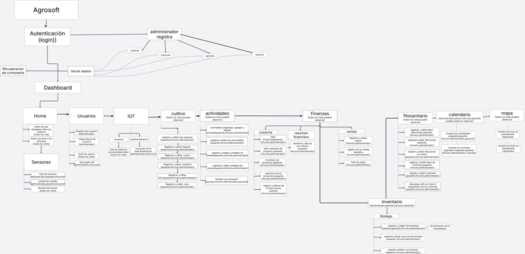

## 8. Funcionalidades
AgroSoft incluye 66 funcionalidades (RF1-RF66), clasificadas como esenciales, ideales u opcionales. A continuación, la lista completa:

ID
Funcionalidad
Descripción
Usuario
Tipo

RF1
Registrar Usuario
Formulario para registrar usuarios (nombre, correo, rol).
Administrador
Esencial

RF2
Editar Usuario
Modificar datos de usuarios existentes.
Administrador
Esencial

RF3
Eliminar Usuario
Eliminar usuarios del sistema.
Administrador
Esencial

RF4
Iniciar Sesión
Autenticación con correo y contraseña.
Todos
Esencial

RF5
Cerrar Sesión
Finalizar sesión del usuario.
Todos
Esencial

RF6
Registrar Insumos
Registro de insumos (nombre, cantidad, precio).
Administrador/Pasante
Esencial

RF7
Editar Insumos
Modificar datos de insumos.
Administrador/Pasante
Esencial

RF8
Eliminar Insumos
Eliminar insumos del inventario.
Administrador
Esencial

RF9
Registrar Herramientas
Registro de herramientas (nombre, cantidad, estado).
Administrador/Pasante
Esencial

RF10
Editar Herramientas
Modificar datos de herramientas.
Administrador/Pasante
Esencial

RF11
Eliminar Herramientas
Eliminar herramientas del inventario.
Administrador
Esencial

RF12
Registrar Cultivos
Registro de cultivos (especie, fechas, ubicación).
Administrador/Pasante
Esencial

RF13
Editar Cultivos
Modificar datos de cultivos.
Administrador/Pasante
Esencial

RF14
Información Sensores en Tiempo Real
Panel con datos IoT (humedad, temperatura, etc.).
Todos
Ideal

RF15
Registrar Semilleros
Registro de semilleros (tipo, cantidad, fecha).
Administrador/Pasante
Esencial

RF16
Editar Semilleros
Modificar datos de semilleros.
Administrador/Pasante
Esencial

RF17
Reportes e Informes
Generación de reportes en PDF/Excel.
Administrador/Instructor
Ideal

RF18
Registrar Lotes
Registro de lotes agrícolas.
Administrador/Pasante
Esencial

RF19
Editar Lotes
Modificar datos de lotes.
Administrador/Pasante
Esencial

RF20
Registrar Eras
Registro de eras agrícolas.
Administrador/Pasante
Esencial

RF21
Editar Eras
Modificar datos de eras.
Administrador/Pasante
Esencial

RF22
Registrar Actividades
Registro de actividades agrícolas (siembra, riego, etc.).
Pasante/Instructor
Esencial

RF23
Editar Actividades
Modificar datos de actividades.
Pasante/Instructor
Esencial

RF24
Registrar Cosechas
Registro de cosechas (cantidad, fecha).
Pasante/Instructor
Esencial

RF25
Editar Cosechas
Modificar datos de cosechas.
Pasante/Instructor
Esencial

RF26
Registrar Ventas
Registro de ventas de productos agrícolas.
Pasante/Instructor
Esencial

RF27
Editar Ventas
Modificar datos de ventas.
Pasante/Instructor
Esencial

RF28
Registrar Plagas
Registro de plagas detectadas.
Pasante/Instructor
Esencial

RF29
Editar Plagas
Modificar datos de plagas.
Pasante/Instructor
Esencial

RF30
Registrar Enfermedades
Registro de enfermedades en cultivos.
Pasante/Instructor
Esencial

RF31
Editar Enfermedades
Modificar datos de enfermedades.
Pasante/Instructor
Esencial

RF32
Configurar Sensores
Configuración de sensores IoT (tipo, ubicación).
Administrador
Esencial

RF33
Editar Configuración Sensores
Modificar configuración de sensores.
Administrador
Esencial

RF34
Eliminar Sensores
Eliminar sensores del sistema.
Administrador
Esencial

RF35
Visualizar Historial Sensores
Consultar datos históricos de sensores.
Todos
Ideal

RF36
Mapa Interactivo de Cultivos
Visualización de cultivos con historial.
Todos
Ideal

RF37
Registrar Costos
Registro de costos asociados a cultivos.
Administrador/Instructor
Esencial

RF38
Editar Costos
Modificar datos de costos.
Administrador/Instructor
Esencial

RF39
Generar Análisis de Rentabilidad
Reportes de rentabilidad por cultivo/lote.
Administrador/Instructor
Ideal

RF40
Registrar Proveedores
Registro de proveedores de insumos.
Administrador
Esencial

RF41
Editar Proveedores
Modificar datos de proveedores.
Administrador
Esencial

RF42
Eliminar Proveedores
Eliminar proveedores del sistema.
Administrador
Esencial

RF43
Registrar Clientes
Registro de clientes para ventas.
Administrador/Instructor
Esencial

RF44
Editar Clientes
Modificar datos de clientes.
Administrador/Instructor
Esencial

RF45
Eliminar Clientes
Eliminar clientes del sistema.
Administrador
Esencial

RF46
Gestionar Permisos
Asignar permisos a usuarios según rol.
Administrador
Esencial

RF47
Consultar Usuarios
Listar usuarios registrados.
Administrador
Esencial

RF48
Consultar Insumos
Listar insumos disponibles.
Todos
Esencial

RF49
Consultar Herramientas
Listar herramientas disponibles.
Todos
Esencial

RF50
Consultar Cultivos
Listar cultivos registrados.
Todos
Esencial

RF51
Consultar Semilleros
Listar semilleros registrados.
Todos
Esencial

RF52
Consultar Lotes
Listar lotes registrados.
Todos
Esencial

RF53
Consultar Eras
Listar eras registradas.
Todos
Esencial

RF54
Consultar Actividades
Listar actividades agrícolas.
Todos
Esencial

RF55
Consultar Cosechas
Listar cosechas registradas.
Todos
Esencial

RF56
Consultar Ventas
Listar ventas realizadas.
Todos
Esencial

RF57
Consultar Plagas
Listar plagas registradas.
Todos
Esencial

RF58
Consultar Enfermedades
Listar enfermedades registradas.
Todos
Esencial

RF59
Consultar Costos
Listar costos registrados.
Administrador/Instructor
Esencial

RF60
Consultar Proveedores
Listar proveedores registrados.
Administrador/Instructor
Esencial

RF61
Consultar Clientes
Listar clientes registrados.
Administrador/Instructor
Esencial

RF62
Exportar Reportes
Exportar reportes en formatos PDF/Excel.
Administrador/Instructor
Ideal

RF63
Configurar Notificaciones
Configurar alertas para eventos agrícolas.
Administrador
Opcional

RF64
Enviar Notificaciones
Enviar alertas por correo o en la plataforma.
Administrador
Opcional

RF65
Gestionar Backups
Realizar copias de seguridad de la base de datos.
Administrador
Opcional

RF66
Restaurar Backups
Restaurar datos desde copias de seguridad.
Administrador
Opcional

## 9. Usuarios – Roles
## 9.1 Administrador

Acceso completo a todos los módulos.
Gestiona usuarios, sensores, cultivos, finanzas, reportes y configuraciones IoT.

## 9.2 Instructor

Gestiona sensores, cultivos, actividades, cosechas, ventas y fitosanidad.
Supervisa procesos agrícolas y formativos.

## 9.3 Pasante

Registra y edita cultivos, actividades, ventas y fitosanidad.
Participa en labores agrícolas.

## 9.4 Visitante

Sin acceso inicial; requiere asignación de rol por el administrador.

## 10. Diagrama de Casos de Uso
10.1 General
Descripción: Representa las interacciones principales entre usuarios y el sistema, incluyendo inicio de sesión, gestión de cultivos, monitoreo IoT y generación de reportes. (Consultar diagrama en el documento original).
10.2 Específicos
Incluye 30 casos de uso, como:

Registro de Usuarios: Formulario para nuevos usuarios.
Inicio de Sesión: Validación de credenciales.
Registro de Cultivos, Semilleros, Lotes, Eras: Gestión agrícola.
Monitoreo IoT: Visualización de datos en tiempo real.
Reportes: Informes de actividades, ventas, rentabilidad.

## 11. Historias de Usuario
AgroSoft incluye 46 historias de usuario (HU1-HU46). Lista completa:

ID
Nombre
Rol
Funcionalidad
Resultado

HU1
Ingreso al Sistema
Usuario
Iniciar sesión con credenciales.
Acceder a funcionalidades según rol.

HU2
Registro de Usuarios
Administrador
Registrar nuevos usuarios.
Asignar privilegios según rol.

HU3
Editar Usuarios
Administrador
Modificar datos de usuarios.
Actualizar información de usuarios.

HU4
Eliminar Usuarios
Administrador
Eliminar usuarios del sistema.
Remover usuarios inactivos.

HU5
Cerrar Sesión
Usuario
Finalizar sesión.
Salir del sistema.

HU6
Registrar Insumos
Administrador/Pasante
Registrar insumos.
Mantener inventario actualizado.

HU7
Editar Insumos
Administrador/Pasante
Modificar datos de insumos.
Actualizar inventario.

HU8
Eliminar Insumos
Administrador
Eliminar insumos.
Remover insumos obsoletos.

HU9
Registrar Herramientas
Administrador/Pasante
Registrar herramientas.
Mantener inventario de herramientas.

HU10
Editar Herramientas
Administrador/Pasante
Modificar datos de herramientas.
Actualizar inventario de herramientas.

HU11
Eliminar Herramientas
Administrador
Eliminar herramientas.
Remover herramientas obsoletas.

HU12
Registrar Cultivos
Administrador/Pasante
Registrar cultivos.
Gestionar ciclos agrícolas.

HU13
Editar Cultivos
Administrador/Pasante
Modificar datos de cultivos.
Actualizar información de cultivos.

HU14
Consultar Sensores en Tiempo Real
Usuario
Ver datos IoT en tiempo real.
Monitorear condiciones ambientales.

HU15
Registrar Semilleros
Administrador/Pasante
Registrar semilleros.
Gestionar semilleros.

HU16
Editar Semilleros
Administrador/Pasante
Modificar datos de semilleros.
Actualizar información de semilleros.

HU17
Generar Reportes
Administrador/Instructor
Generar reportes PDF/Excel.
Obtener informes analíticos.

HU18
Registrar Lotes
Administrador/Pasante
Registrar lotes.
Gestionar lotes agrícolas.

HU19
Editar Lotes
Administrador/Pasante
Modificar datos de lotes.
Actualizar información de lotes.

HU20
Registrar Eras
Administrador/Pasante
Registrar eras.
Gestionar eras agrícolas.

HU21
Editar Eras
Administrador/Pasante
Modificar datos de eras.
Actualizar información de eras.

HU22
Registrar Actividades
Pasante/Instructor
Registrar actividades agrícolas.
Documentar labores agrícolas.

HU23
Editar Actividades
Pasante/Instructor
Modificar datos de actividades.
Actualizar labores agrícolas.

HU24
Registrar Cosechas
Pasante/Instructor
Registrar cosechas.
Documentar cosechas.

HU25
Editar Cosechas
Pasante/Instructor
Modificar datos de cosechas.
Actualizar información de cosechas.

HU26
Registrar Ventas
Pasante/Instructor
Registrar ventas.
Documentar ventas.

HU27
Editar Ventas
Pasante/Instructor
Modificar datos de ventas.
Actualizar información de ventas.

HU28
Registrar Plagas
Pasante/Instructor
Registrar plagas.
Documentar plagas.

HU29
Editar Plagas
Pasante/Instructor
Modificar datos de plagas.
Actualizar información de plagas.

HU30
Registrar Enfermedades
Pasante/Instructor
Registrar enfermedades.
Documentar enfermedades.

HU31
Editar Enfermedades
Pasante/Instructor
Modificar datos de enfermedades.
Actualizar información de enfermedades.

HU32
Configurar Sensores
Administrador
Configurar sensores IoT.
Ajustar monitoreo ambiental.

HU33
Editar Configuración Sensores
Administrador
Modificar configuración de sensores.
Actualizar ajustes de sensores.

HU34
Eliminar Sensores
Administrador
Eliminar sensores.
Remover sensores obsoletos.

HU35
Mostrar Cultivos en Mapa
Usuario
Visualizar cultivos en mapa interactivo.
Consultar historial de cultivos.

HU36
Registrar Costos
Administrador/Instructor
Registrar costos.
Documentar costos agrícolas.

HU37
Editar Costos
Administrador/Instructor
Modificar datos de costos.
Actualizar información de costos.

HU38
Generar Análisis de Rentabilidad
Administrador/Instructor
Generar reportes de rentabilidad.
Analizar rentabilidad.

HU39
Registrar Proveedores
Administrador
Registrar proveedores.
Gestionar proveedores.

HU40
Editar Proveedores
Administrador
Modificar datos de proveedores.
Actualizar información de proveedores.

HU41
Eliminar Proveedores
Administrador
Eliminar proveedores.
Remover proveedores obsoletos.

HU42
Registrar Clientes
Administrador/Instructor
Registrar clientes.
Gestionar clientes.

HU43
Editar Clientes
Administrador/Instructor
Modificar datos de clientes.
Actualizar información de clientes.

HU44
Eliminar Clientes
Administrador
Eliminar clientes.
Remover clientes obsoletos.

HU45
Configurar Notificaciones
Administrador
Configurar alertas agrícolas.
Recibir notificaciones.

HU46
Gestionar Backups
Administrador
Realizar copias de seguridad.
Proteger datos del sistema.

Ejemplo detallado (HU1):

Rol: Usuario.
Funcionalidad: Iniciar sesión.
Flujo Normal:
Ingresa al sistema.
Sistema muestra ventana de login.
Ingresa identificación y contraseña.
Sistema valida y asigna permisos.

Criterios de Aceptación:
Ingreso exitoso: Muestra nombre del usuario.
Ingreso fallido: Mensaje de datos inválidos.

## 12. Diagrama de Clases
Descripción: Define las entidades principales (Usuario, Cultivo, Sensor, Insumo, Herramienta, Semillero, Lote, Era, Actividad, Cosecha, Venta, Plaga, Enfermedad, Costo, Proveedor, Cliente) y sus relaciones. 

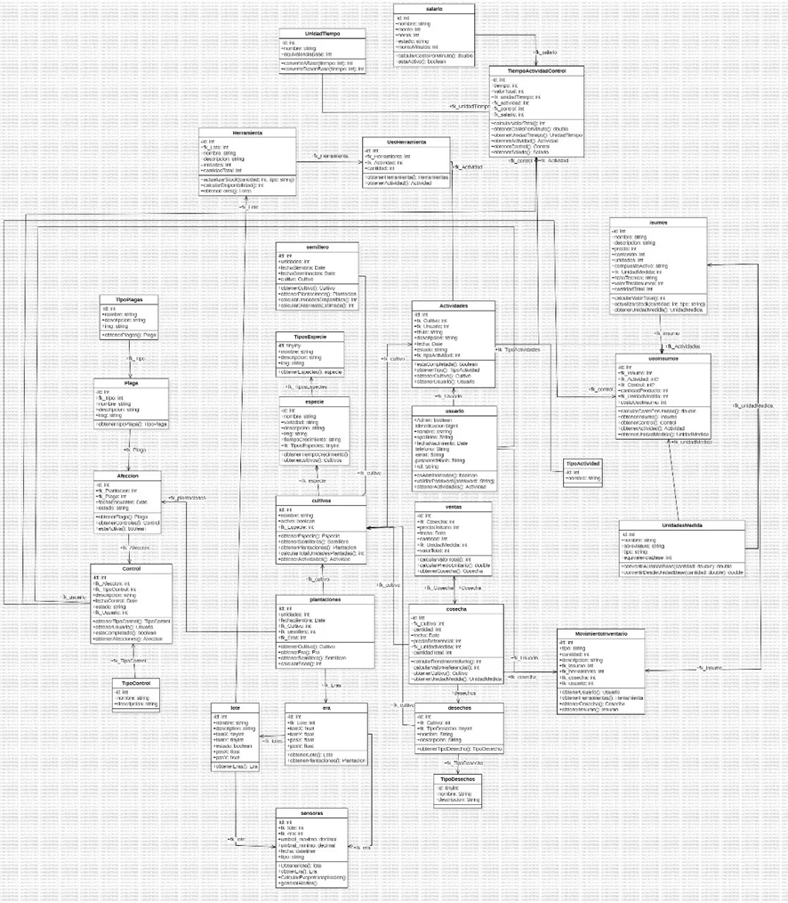

## 13. Diagrama de Casos de Uso
Descripción: Complementa la sección 10, detallando interacciones específicas entre roles y módulos del sistema. 

## 14. Prototipo de Interfaz
Descripción: Incluye mockups de la interfaz de usuario, con pantallas para:

Inicio de sesión.
Panel principal.
Gestión de usuarios, cultivos, insumos, herramientas, semilleros, lotes, eras, actividades, cosechas, ventas, plagas.
Monitoreo IoT en tiempo real.
Mapa interactivo de cultivos.
Generación de reportes.

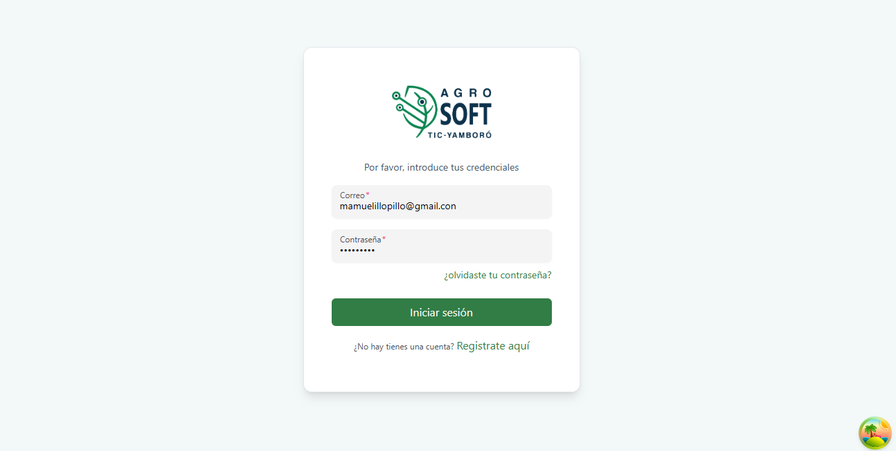
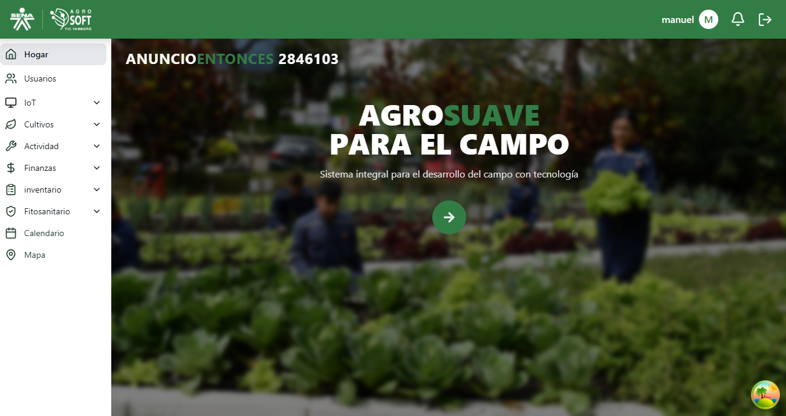
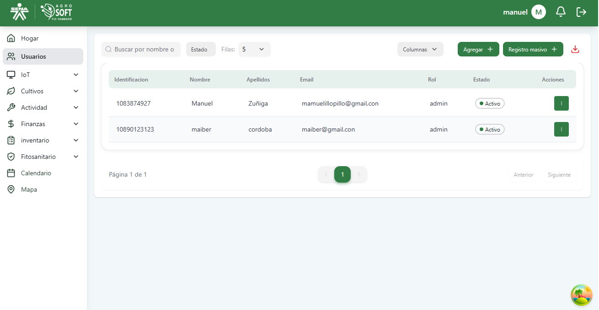
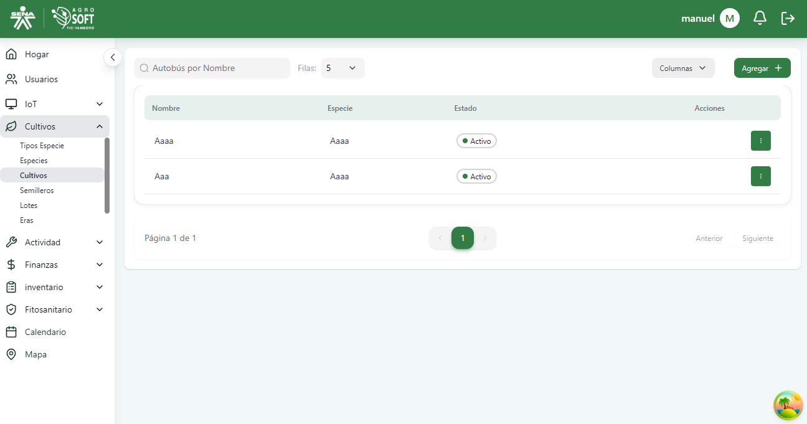
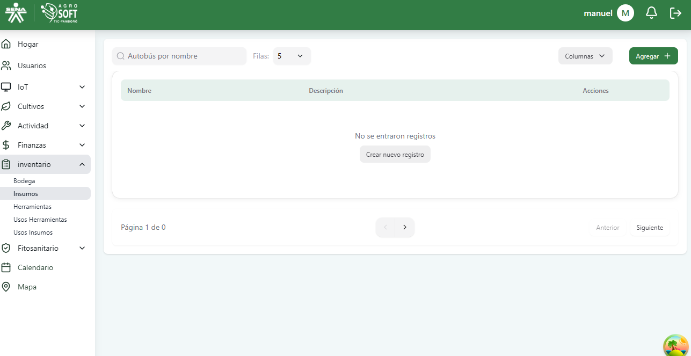
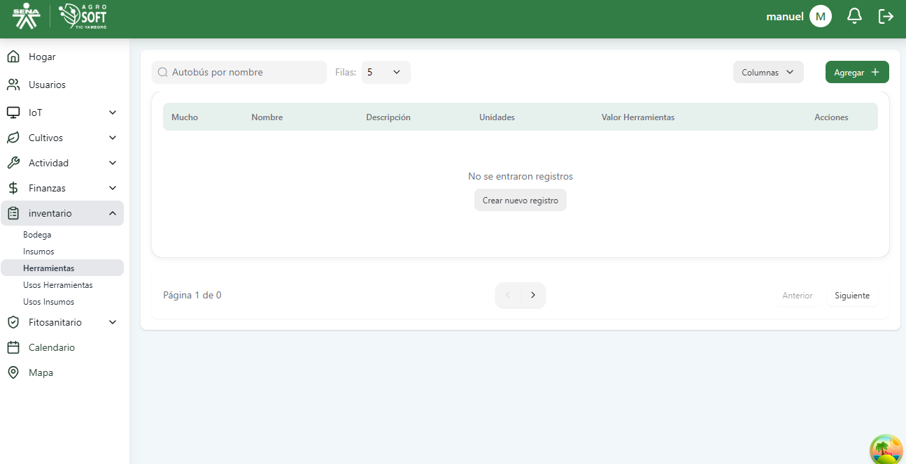
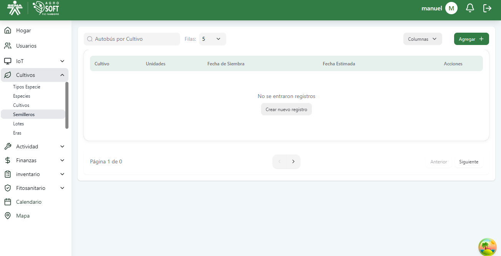
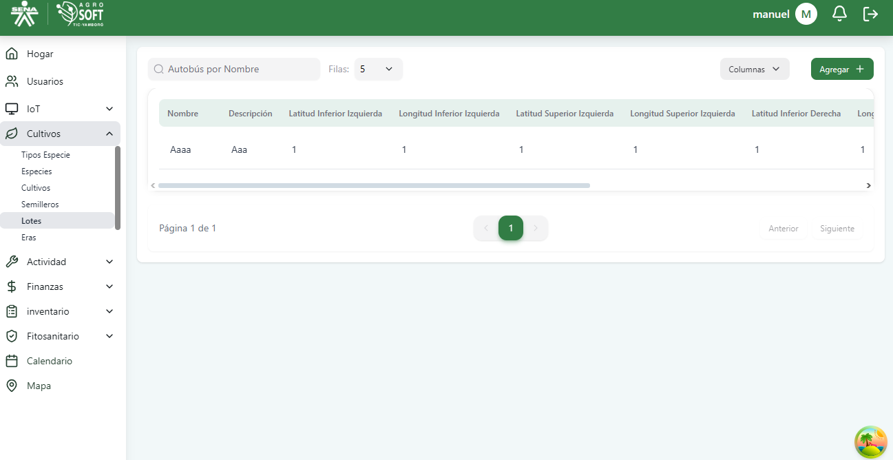
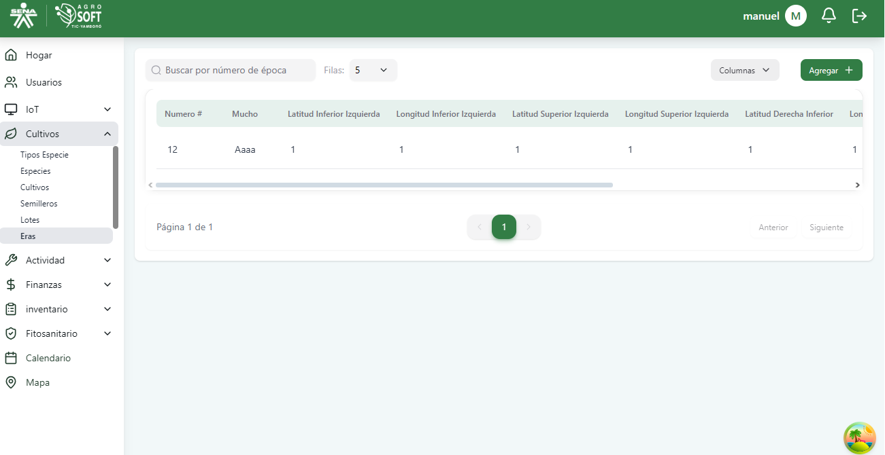
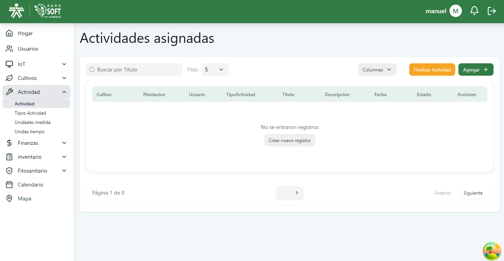
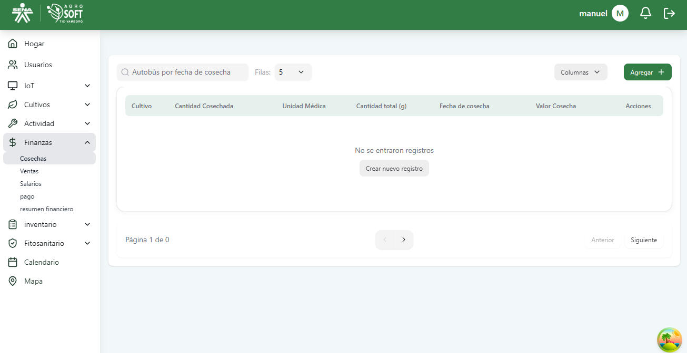
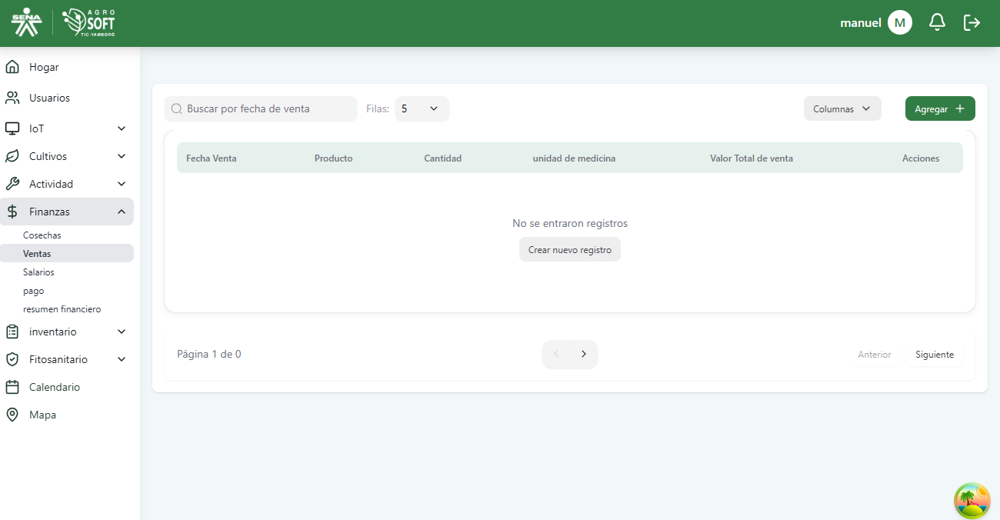
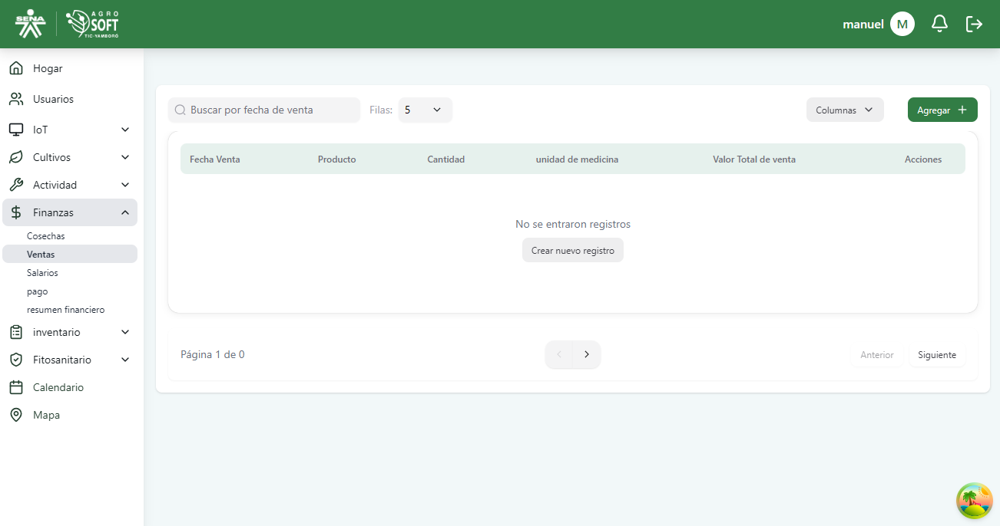
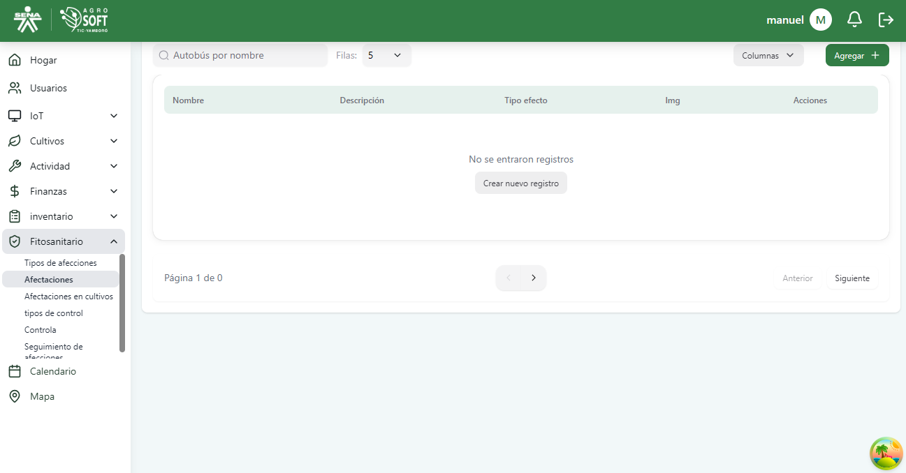
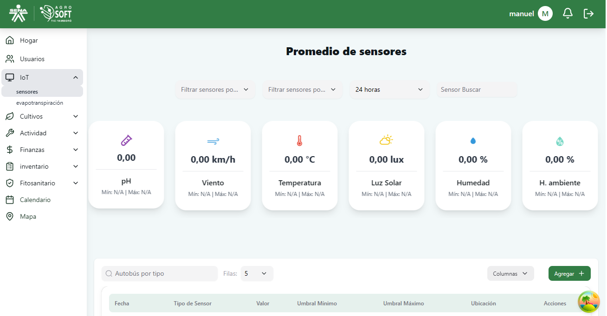
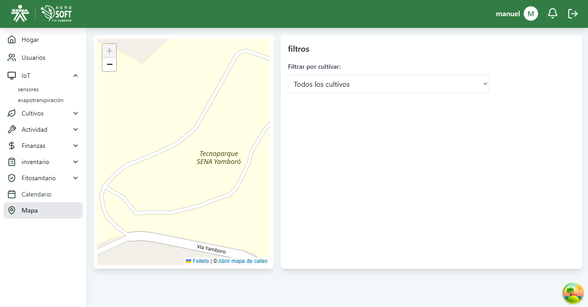
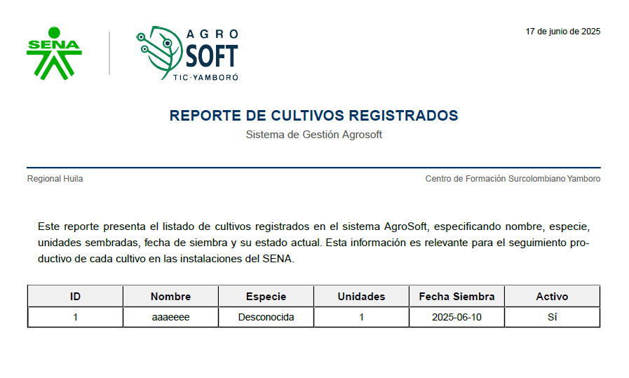

## 15. Modelo de Base de Datos
Descripción: Modelo relacional con tablas para:

Usuarios (id, nombre, correo, contraseña, rol).
Cultivos (id, especie, fecha_siembra, lote_id).
Sensores (id, tipo, valor, ubicación).
Insumos (id, nombre, cantidad, precio).
Herramientas (id, nombre, cantidad, estado).
Semilleros, Lotes, Eras, Actividades, Cosechas, Ventas, Plagas, Enfermedades, Costos, Proveedores, Clientes.

## 16. Requerimientos

Funcionales: 66 funcionalidades (RF1-RF66) descritas en la sección 8.
No Funcionales:
Rendimiento: Tiempo de respuesta < 2 segundos para consultas.
Escalabilidad: Soporte para 100 usuarios concurrentes.
Seguridad: Encriptación AES-256 para contraseñas, autenticación por roles.
Compatibilidad: Navegadores modernos y dispositivos móviles.
Usabilidad: Interfaz intuitiva, tiempo de aprendizaje < 10 minutos.
Mantenimiento: Código modular para actualizaciones futuras.

## 17. Tecnologías

Frontend: React, Vite, TypeScript, Tailwind CSS.
Backend: Node.js, Express.js.
Base de datos: PostgreSQL.
IoT: Protocolos HTTP/MQTT, integración con ESP32.
Herramientas de desarrollo: Git, Docker, VS Code.
Infraestructura: Servidor en la nube (AWS/Heroku), compatible con entornos locales.

## 18. Conclusiones
AgroSoft optimiza la gestión agrícola en la unidad productiva PAE, integrando tecnología IoT para monitoreo en tiempo real y trazabilidad. Mejora la eficiencia, reduce pérdidas y apoya la formación técnica en el SENA. La plataforma es escalable, segura y adaptable a otras unidades productivas, contribuyendo al desarrollo sostenible.

## 19. Recomendaciones

Capacitación: Formar a usuarios en el uso de la plataforma.
Mantenimiento: Actualizar sensores y software regularmente.
Expansión: Integrar predicción de cosechas y automatización de riego en futuras versiones.
Pruebas: Realizar pruebas de carga con más usuarios concurrentes.
Soporte: Establecer un equipo de soporte técnico para incidencias.

